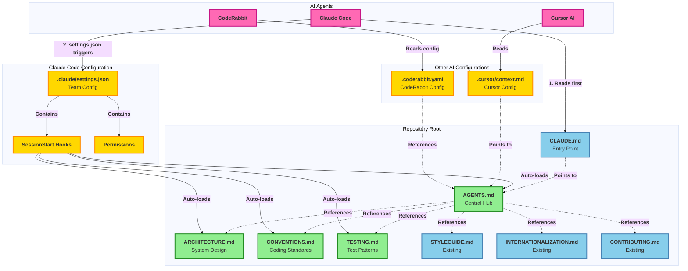

# AI Documentation Access Flow

This diagram shows how different AI coding agents (Claude Code, Cursor, CodeRabbit) access the documentation in this repository.

## Flow Diagram

## Legend

- **🟢 Green boxes**: New files to be created
- **🔵 Blue boxes**: Existing files (updated or unchanged)
- **🟡 Yellow boxes**: Configuration files
- **🌸 Pink boxes**: AI agents/tools
- **Solid arrows** (→): Direct automated loading
- **Dotted arrows** (⇢): References/pointers or optional access

---

## How Each AI Agent Accesses Documentation

### Claude Code (Fully Automated)

**Loading Sequence:**
1. Reads `CLAUDE.md` at session start (automatic)
2. `.claude/settings.json` triggers `SessionStart` hooks
3. Hooks automatically load all documentation files:
   - `AGENTS.md` - Central hub and quick start
   - `ARCHITECTURE.md` - System architecture and Plugin SDK
   - `CONVENTIONS.md` - Coding standards and review patterns
   - `TESTING.md` - Testing strategies

**Key Feature**: Zero manual intervention - all files loaded automatically via hooks

---

### Cursor AI (Configuration-Based)

**Loading Sequence:**
1. Reads `.cursor/context.md` configuration
2. Configuration points to `AGENTS.md` as the central hub
3. Can manually access other files as needed

**Key Feature**: Configuration-directed discovery with manual access to specialized files

---

### CodeRabbit (PR Review Focus)

**Loading Sequence:**
1. Reads `.coderabbit.yaml` configuration
2. Configuration references documentation for PR review:
   - `CONVENTIONS.md` - Review standards and patterns
   - `ARCHITECTURE.md` - Understanding system structure
   - `TESTING.md` - Test requirements

**Key Feature**: Targeted at PR review automation with specific file references

---

## Benefits of This Architecture

### ✅ Universal Accessibility
- All files at repository root for easy discovery
- No nested directory navigation
- Clear, descriptive filenames (`ARCHITECTURE.md`, `CONVENTIONS.md`, etc.)

### ✅ Single Source of Truth
- One file per topic (no duplication)
- Update once, all AI agents benefit
- Clear separation of concerns

### ✅ Flexible Integration
- Each AI tool integrates at its own level:
  - Claude Code: Fully automated via hooks
  - Cursor: Configuration-based
  - CodeRabbit: PR review focused

### ✅ Maintainable
- Update individual files without affecting others
- Clear ownership and maintenance schedule
- Easy to add new files (e.g., `ACCESSIBILITY.md`, `PERFORMANCE.md`)

### ✅ Team vs Personal
- Team configuration checked into git
- Personal configuration (`.claude/settings.local.json`) gitignored
- Clean separation of concerns

---

## File Responsibilities

| File | Purpose | Primary Consumer |
|------|---------|------------------|
| `AGENTS.md` | Central hub, quick start, overview | All AI agents |
| `ARCHITECTURE.md` | System design, Plugin SDK, monorepo structure | Developers, AI making structural changes |
| `CONVENTIONS.md` | Coding standards, review patterns (P0/P1) | PR reviews, code generation |
| `TESTING.md` | Test strategies, patterns, commands | Test generation, test fixes |
| `STYLEGUIDE.md` | Detailed formatting rules | Code formatting |
| `INTERNATIONALIZATION.md` | i18n workflow and patterns | i18n feature work |
| `CONTRIBUTING.md` | Contribution process | New contributors |

---

## Viewing This Diagram

### On GitHub
When this file is viewed on GitHub, the Mermaid diagram will render automatically with full styling and interactivity.

### Locally
To view locally, use one of these options:

1. **VS Code**: Install the "Markdown Preview Mermaid Support" extension
2. **Browser**: Use the [Mermaid Live Editor](https://mermaid.live/)
3. **CLI**: Install `mermaid-cli` and run `mmdc -i AI-DOCUMENTATION-FLOW.md -o diagram.png`

### Exporting
To export as an image:
- **GitHub**: Take a screenshot of the rendered diagram
- **Mermaid Live Editor**: Copy the diagram code and export as PNG/SVG
- **CLI**: Use `mermaid-cli` to generate PNG/SVG/PDF

---

**Last Updated**: 2025-12-03
**Reflects**: Flattened documentation structure (files at root, not in `.ai/` subdirectory)
